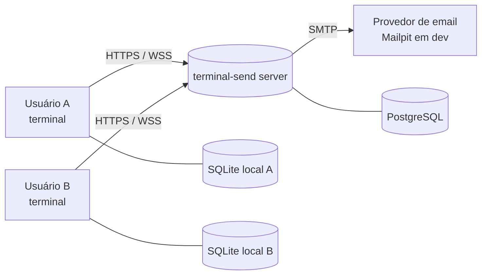
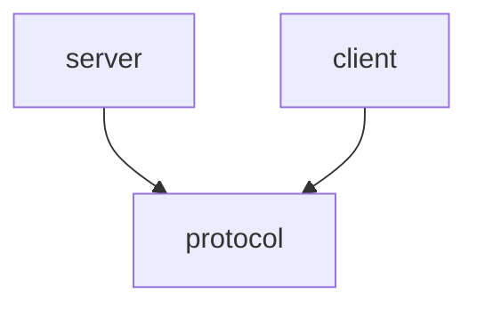
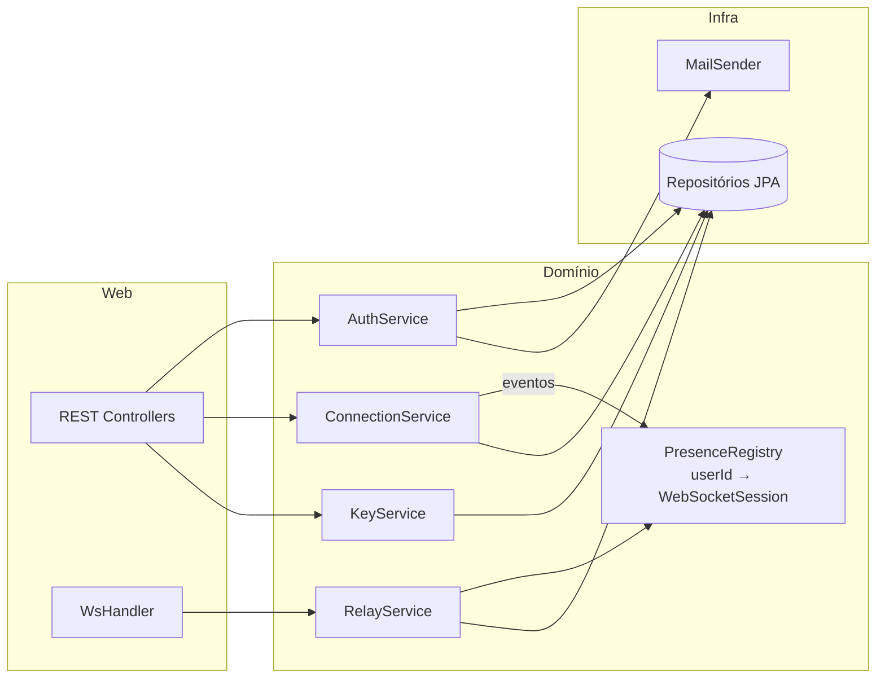
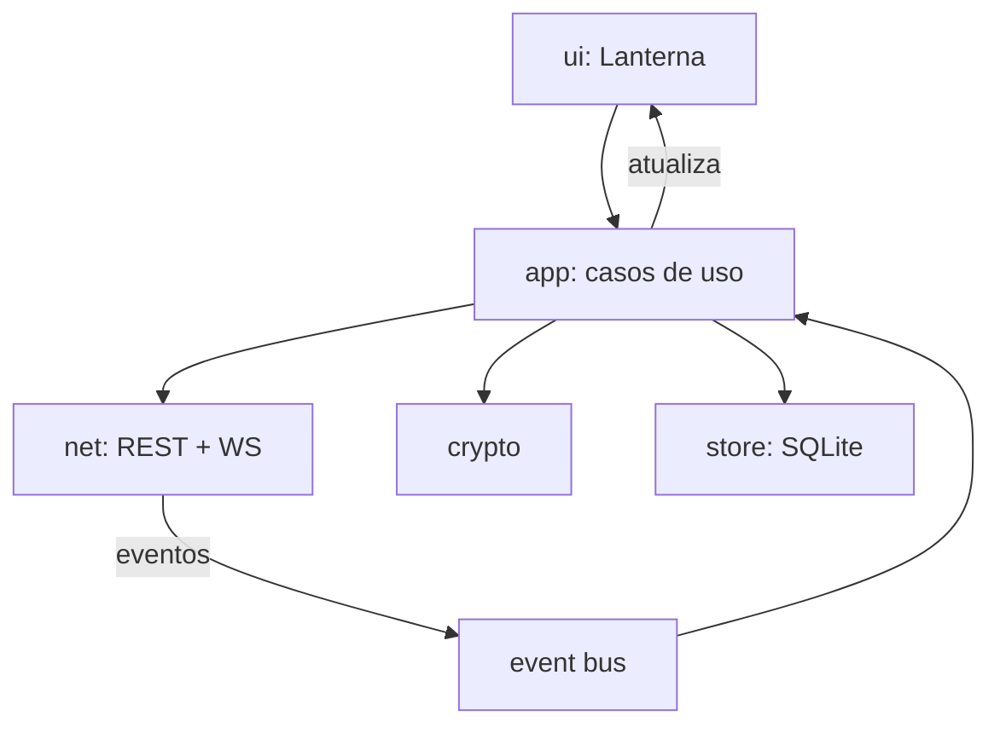
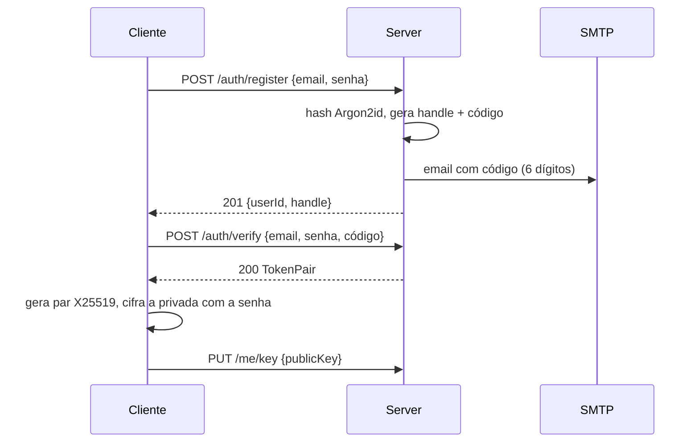
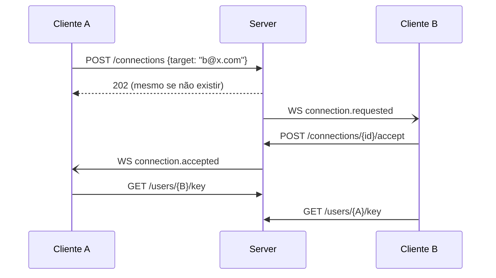
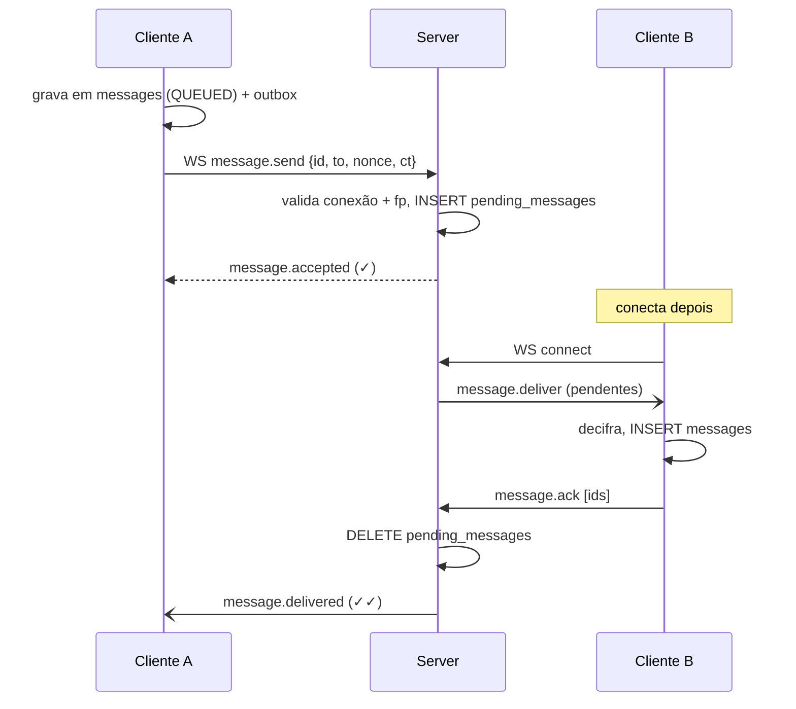

# terminal-send — Arquitetura

Complementa a [tech-spec](tech-spec.md). Os diagramas usam Mermaid e são renderizados pelo GitHub.

## 1. Contexto



- O **servidor** é um relay autenticado: guarda usuários, conexões, chaves públicas e
  envelopes **ainda não entregues**, mas nunca o texto das mensagens.
- Cada **cliente** é dono do seu histórico (SQLite) e da sua chave privada.

## 2. Módulos (monorepo Gradle)

```
terminal-send/
├── protocol/   # Java puro: DTOs REST, frames WS, validação de handle/email. Sem Spring.
├── server/     # Spring Boot 4: API REST, WebSocket, JPA, Flyway, Mail.
├── client/     # App de terminal: Lanterna, HttpClient/WebSocket, SQLite, cripto.
├── docs/
└── docker-compose.yml   # postgres + mailpit para dev
```



O `protocol` é o **contrato** compartilhado: qualquer mudança nele quebra a compilação
de quem não acompanhou, e isso evita divergência de JSON entre cliente e servidor.

## 3. Servidor

Organização **por feature** (package-by-feature), com camadas dentro de cada uma:

```
dev.terminalsend.server
├── auth/           AuthController, AuthService, JwtService, RefreshTokenRepository
├── verification/   EmailVerificationService, VerificationCodeRepository
├── mail/           MailSender (port) + SmtpMailSender (adapter) + templates
├── user/           User (entity), UserRepository, MeController, HandleGenerator
├── key/            KeyController, KeyService
├── connection/     ConnectionController, ConnectionService, Connection (entity)
├── messaging/      RelayService, PendingMessageRepository, PresenceRegistry
├── ws/             WsConfig, WsAuthInterceptor, WsHandler (JSON ⇄ frames)
├── config/         SecurityConfig, ClockConfig, properties
└── common/         ProblemDetails, ApiException, ErrorCode
```



**Eventos internos**: `ConnectionService` e `KeyService` publicam `ApplicationEvent`s
(`ConnectionRequested`, `ConnectionAccepted`, `KeyChanged`). Um listener com
`@TransactionalEventListener(AFTER_COMMIT)` transforma esses eventos em frames WS, para
que nenhuma notificação saia de uma transação revertida.

**PresenceRegistry**: um `ConcurrentHashMap<UUID, WebSocketSession>`. Os envios usam
`ConcurrentWebSocketSessionDecorator`, porque o `WebSocketSession` não é thread-safe. Para
escalar horizontalmente, essa interface ganha uma implementação com Redis.

**Segurança**: Spring Security stateless. `oauth2-resource-server` valida o JWT HS256
(`NimbusJwtDecoder` com segredo de env). O endpoint `/ws` usa o mesmo decoder num
`HandshakeInterceptor`.

## 4. Cliente

Arquitetura em camadas, com a UI isolada atrás de interfaces:

```
dev.terminalsend.client
├── Main                     # bootstrap, lê config, sobe a UI
├── ui/                      # Lanterna: LoginWindow, VerifyWindow, MainWindow (contatos | chat)
├── app/                     # casos de uso: AuthService, ContactService, ChatService
├── net/                     # ApiClient (HttpClient), RealtimeClient (WebSocket + reconexão)
├── crypto/                  # IdentityKeys, PairKeyDeriver (HKDF), EnvelopeCipher, KeyFileStore
├── store/                   # LocalStore (SQLite/JDBC), migrations, Outbox
└── event/                   # EventBus simples (eventos do WS → UI)
```



- **Threads**: a thread de UI do Lanterna só desenha. O WebSocket entrega callbacks em
  threads do `HttpClient`, que publicam no `EventBus`. O `app` processa (decifra e grava)
  e devolve atualizações para a UI via `gui.getGUIThread().invokeLater(...)`.
- **Reconexão**: backoff exponencial com jitter (1 s → 30 s). Ao reconectar, o `Outbox` é
  drenado e o servidor reenvia os pendentes.
- **Comandos** no campo de entrada: `/add <email|ts-id>`, `/invites`, `/accept <n>`,
  `/reject <n>`, `/verify <contato>`, `/clear`, `/logout`, `/quit`.

### Esboço da TUI

```
┌ Contatos ──────────┬ ana@exemplo.com (ts-7KQ2MX) ───────────────────┐
│ ● ana       (2)    │ [12:01] ana: oi!                               │
│ ○ bruno            │ [12:02] você: e aí, tudo certo?            ✓✓ │
│ ─ Convites (1) ─   │                                                │
│ ? carla@x.com      │                                                │
│                    ├────────────────────────────────────────────────┤
│                    │ > _                                            │
└────────────────────┴ online · fp 3f2a 91c0 … ── Ctrl+C sair ────────┘
```
`✓` = aceito pelo servidor · `✓✓` = entregue ao destinatário.

## 5. Fluxos

### 5.1 Cadastro e verificação



### 5.2 Conexão



### 5.3 Mensagem (B offline → online)



Com B online, o servidor tenta a entrega direta, mas **persiste do mesmo jeito** antes do
`message.accepted`. Isso dá um único caminho de código, e o `DELETE` no ACK cobre os dois
casos.

## 6. Ambientes e deploy

| Ambiente | Server | Banco | Email |
|----------|--------|-------|-------|
| dev | `./gradlew :server:bootRun` | Postgres no docker-compose | Mailpit (UI em http://localhost:8025) |
| test | Testcontainers | Postgres efêmero | GreenMail embutido |
| prod | Imagem OCI (`bootBuildImage`) atrás de proxy TLS | Postgres gerenciado | SMTP via env |

Configuração por variáveis de ambiente: `TS_DB_URL`, `TS_DB_USER`, `TS_DB_PASSWORD`,
`TS_JWT_SECRET`, `TS_MAIL_HOST`, `TS_MAIL_PORT`, `TS_MAIL_USER`, `TS_MAIL_PASSWORD`,
`TS_MAIL_FROM`.

O cliente é distribuído como fat-jar (`./gradlew :client:shadowJar`), com o servidor
configurável em `~/.terminal-send/config.properties` ou via `--server`.
